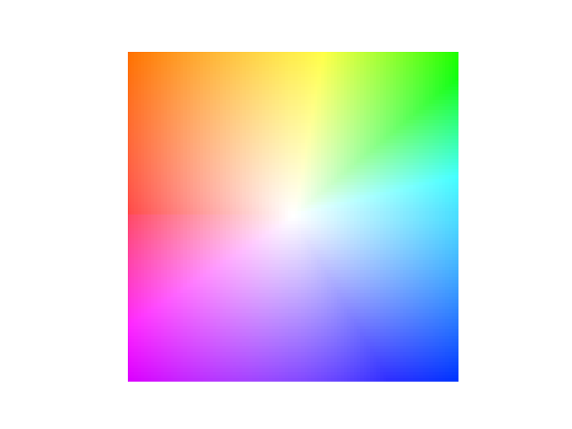
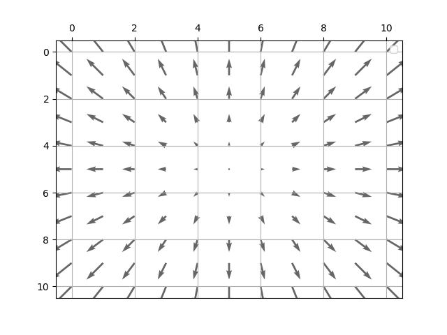
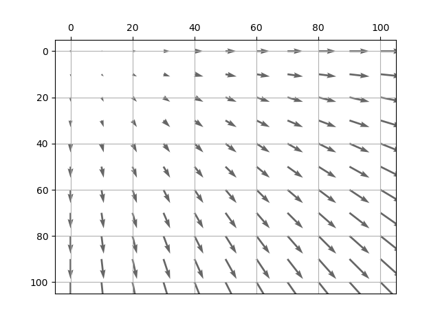
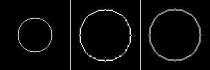

# 光流

## 生成光流
```python
from gen_flow import gen_flow_circle

case = 1  # 1 or 2
height = 101
width = 101
if case == 1:
    flow = gen_flow_circle([height//2, width//2], height, width)
    flow = flow / 3
else:
    flow = gen_flow_circle([0,0], height, width)
    flow = flow / 5

print(flow[:,:,0])
print(flow[:,:,1])
```

## 光流可视化
### 稠密光流
```python
from flow_display import dense_flow

dense_flow(flow)
```
#### case 1


#### case 2


### 稀疏光流
```python
from flow_display import sparse_flow

sparse_flow(flow, stride=10)
```
#### case 1


#### case 2


## backward warp
```python
from image_warp import image_warp

# nearest or bilinear
deformed_nearest = image_warp(img.copy(), flow, mode='nearest')
deformed_bilinear = image_warp(img.copy(), flow, mode='bilinear')
```

### case 1


### case 2
